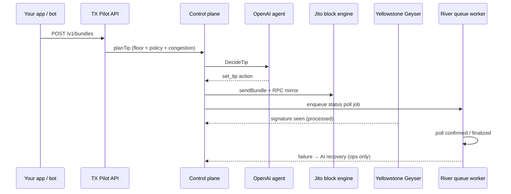

# TX Pilot — Autonomous Solana Transaction Control Plane

**Working prototype on mainnet-beta.** Plug in your RPC, Yellowstone, and OpenAI credentials, fund an ops keypair, and run.

Built for trading bots, consumer apps, and any workload pushing high transaction volume. TX Pilot handles submission, tip planning, lifecycle tracking, failure classification, and AI-assisted recovery so you can see *why* a transaction landed or failed instead of guessing from a signature alone.


---

## Why Solana is different from Bitcoin and EVM chains

On Bitcoin and Ethereum, transactions sit in a **public mempool**. Validators or miners pick from that pool, ordering is uncertain, and propagation adds latency before anything executes.

```
  Bitcoin / EVM (simplified)

  Wallet ──► Mempool (shared, unordered pool)
                  │
                  ▼
            Validator / miner picks txs
                  │
                  ▼
               Block
```

Solana was built for throughput. Instead of a global mempool gossip model, **Gulf Stream** forwards transactions directly toward the **TPU** (Transaction Processing Unit) of the upcoming **leader** validator. Leaders rotate every **slot (~400 ms)**. You are racing the clock against slot boundaries and leader schedules, not waiting in a public queue.

```
  Solana (simplified)

  Wallet ──► RPC / TPU path ──► Current leader's TPU
                                      │
                               ~400 ms slot
                                      │
                                      ▼
                               Leader builds block
                                      │
                               Next leader already known
                               (schedule known in advance)
```

That design is why blockhash freshness, leader timing, and tip economics matter more here than on EVM. A transaction can look "sent" while missing the leader window entirely.

---

## What TX Pilot does

TX Pilot is a transaction operations layer you run beside your app. Your bot or frontend signs payloads locally; TX Pilot handles the operational work around getting them landed and understood.

| Capability | How |
|------------|-----|
| **Jito bundles + MEV protection** | Client bundles get a server-signed tip tx appended; submissions go through Jito's block engine with RPC fallback. Atomic bundle ordering reduces sandwich exposure compared to broadcasting blindly to the public mempool. |
| **Dynamic tips** | Live Jito tip floor + policy mode (`SAFE` / `FAST` / `CHEAP` / `AGGRESSIVE`) + congestion and leader multipliers. OpenAI adjusts the final tip per submission. |
| **AI operations agent** | Tip intelligence on every submit; failure reasoning and autonomous retry on server ops txs (refresh blockhash, recalc tip, resubmit). |
| **Geyser streaming** | Yellowstone gRPC for slots, leaders, and signature landing with reconnect and backpressure. Stream hits `processed` before RPC polling catches up. |
| **Per-transaction workers** | Each submission spawns its own durable River job. Child workers poll status, classify failures, and trigger recovery independently. One slow tx does not block the rest. |
| **Observability** | REST + WebSocket dashboard, lifecycle timelines, failure taxonomy, and bounty-grade lifecycle export. |

### Submission paths

| Endpoint | What happens |
|----------|--------------|
| `POST /v1/transactions` | Pre-signed client tx forwarded unchanged via Jito + RPC. Tip in the response is **advisory** (re-signing would break the signature). |
| `POST /v1/bundles` | 1–4 client txs + server-signed dynamic tip appended, submitted as a Jito bundle + RPC mirror. |
| `POST /v1/ops/submit` | Server-signed self-transfer with embedded tip. Used for demos, lifecycle evidence, and autonomous recovery. |

### How a submission flows



### MEV and sandwich protection (practical view)

A classic sandwich attack front-runs and back-runs your swap around public mempool visibility. Routing through **Jito bundles** with a private submission path gives you **atomic ordering**: your txs execute together or not at all, without unrelated txs inserted between them. TX Pilot appends a dynamically priced tip so bundles stay competitive without hardcoded values.

This is not a guarantee against all MEV, but it is strictly better than firing unsigned-order transactions into a public RPC and hoping.

### Queue and worker model

TX Pilot uses **Go goroutines** for hot paths (Geyser reader, dashboard broadcast, lifecycle fanout) and **River** (Postgres-backed) for durable per-transaction work.

When a transaction is submitted, the control plane inserts a **status poll job**. River picks it up on any available worker goroutine. That worker owns the poll loop for *that* transaction only: RPC signature status, Jito bundle status, blockhash expiry checks, failure classification, and recovery trigger. Jobs retry on their own schedule (~2 s while pending, up to 5 minutes total) without blocking other submissions.

```
  Submit tx_A ──► River job_A ──► worker polls A ──► confirmed / failed
  Submit tx_B ──► River job_B ──► worker polls B ──► confirmed / failed
  Submit tx_C ──► River job_C ──► worker polls C ──► confirmed / failed

  (A, B, C run in parallel; failure on B does not stall A or C)
```

Lifecycle events are written through **8 sharded channels** so concurrent transactions append events in parallel without a single global lock.

Inspect live jobs at `http://localhost:8080/riverui`.

### Why Go (not Rust or Node.js)

We chose **Go** for the control plane because goroutines and channels are a natural fit for this workload:

- **Thousands of concurrent submissions** without a thread-per-request cost. Each transaction gets its own poll loop and lifecycle shard without manual pthread tuning.
- **Simple worker pools** for Geyser ingestion, lifecycle tracking, and River job handlers with clear cancellation via `context`.
- **Fast iteration** on operational tooling (CLI, demos, integration tests) while still compiling to a single static binary for production.

Rust would give similar concurrency with more upfront complexity for API iteration speed. Node.js async works for I/O but struggles with CPU-bound signature handling and long-lived worker supervision at high fanout. Go sits in the middle: fast enough, operable, and built for exactly this kind of network service.

---

## Quick start

Full guide: [docs/setup.md](docs/setup.md)

```bash
cp .env.example .env          # add RPC, Yellowstone, OpenAI, DATABASE_URL
make test-keypair             # creates tx-pilot-test-keypair.json
make docker-up && make migrate-up
make dev                      # API + dashboard at http://localhost:8080
```

| | |
|---|---|
| **Ops keypair** | `TX_PILOT_KEYPAIR_PATH=./tx-pilot-test-keypair.json` |
| **Used for** | Bundle tip signing, ops submit, autonomous recovery |
| **Fund** | ~0.05 SOL on mainnet-beta for demos and lifecycle runs |

---

## API (summary)

| Endpoint | Description |
|----------|-------------|
| `POST /v1/transactions` | Forward pre-signed tx; advisory tip in response |
| `POST /v1/bundles` | Client txs + server-signed dynamic tip |
| `POST /v1/ops/submit` | Server-signed ops tx with embedded tip |
| `GET /v1/lifecycle-log` | Bounty lifecycle export |
| `GET /v1/transactions/{id}` | Poll status |
| `GET /v1/transactions/{id}/timeline` | Stage events + `latency_ms` |
| `GET /v1/dashboard/*` | Live ops dashboard |
| `GET /v1/ws` | WebSocket streams (`transactions.stream`, `ai.decisions`, `failures.analysis`) |

```bash
# Client bundle with server-appended tip
curl -X POST http://localhost:8080/v1/bundles \
  -H 'Content-Type: application/json' \
  -d '{"transactions":["<signed-base64>"],"policy_mode":"SAFE"}'

# Ops fault injection (AI recovery demo)
curl -X POST http://localhost:8080/v1/ops/submit \
  -H 'Content-Type: application/json' \
  -d '{"memo":"demo-expired","inject_expired_blockhash":true}'
```

Optional `tip_lamports` overrides the AI/heuristic tip (still clamped to the live floor).

---

## Bounty README questions

These answers come from running TX Pilot on **mainnet-beta** with live Yellowstone, Jito, and OpenAI.

### 1. What does the delta between `processed_at` and `confirmed_at` tell you about network health?

`processed` means a leader included your transaction and the cluster has seen it. `confirmed` means a supermajority voted on that fork. The gap between them is a congestion signal.

When the delta is small (hundreds of ms), the cluster is keeping up: leaders produce blocks on schedule and voting keeps pace. When it widens to multiple seconds, validators are ingesting work faster than the cluster can finalize votes. Under that shape, landing probability drops even if your submission returned success immediately. TX Pilot stores this delta in `lifecycle_events.latency_ms` and surfaces it in the dashboard pipeline so you can correlate tip size, leader, and confirmation lag on real traffic.

### 2. Why should you never use `finalized` commitment when fetching a blockhash for a time-sensitive transaction?

`finalized` trails the chain tip by roughly **32 slots (~13 seconds at 400 ms/slot)**. A blockhash that looks valid at `finalized` may already be expired at the current tip where your transaction would actually land. Time-sensitive submits need the freshest hash possible. TX Pilot always fetches blockhashes at **`processed` commitment** for tip and ops signing to maximize the valid window.

### 3. What happens to your bundle if the Jito leader skips their slot?

Each slot has an assigned leader with a narrow window to accept bundles through the block engine. If that leader **skips** their slot (no block produced), your bundle does not execute in that window. It may land on a later attempt if the blockhash is still valid and a subsequent leader picks it up, or it expires and fails.

TX Pilot watches slot gaps on the Geyser feed, records leader context on every lifecycle event, and may delay one slot in `SAFE`/`CHEAP` modes when the schedule looks unfavorable. If the bundle never lands, the failure is classified (e.g. `bundle_rejected`, `expired_blockhash`) and the AI agent chooses recovery: tip increase, delay, or blockhash refresh for ops transactions.

Evidence from our lifecycle runs: 8/10 ops bundles finalized within ~15 s; 2/10 failed with injected expired blockhash and triggered autonomous recovery. See [docs/lifecycle-log.md](docs/lifecycle-log.md).

---

## Stack

Go · Chi · Postgres · sqlc · goose · River · Yellowstone gRPC · Jito block engine · OpenAI `gpt-4o-mini`

---

## Documentation

| Doc | Read this for |
|-----|-------------|
| [docs/setup.md](docs/setup.md) | Install, `.env` variables, Docker Postgres, migrations, first run |
| [docs/architecture.md](docs/architecture.md) | Components, tip planning pipeline, signing model, AI boundaries |
| [docs/operations.md](docs/operations.md) | Submit flows, curl examples, CLI helper, polling |
| [docs/dashboard-data.md](docs/dashboard-data.md) | REST and WebSocket contract for the ops dashboard |
| [docs/lifecycle-log.md](docs/lifecycle-log.md) | Lifecycle export format and bounty evidence collection |
| [docs/lifecycle-log-evidence.md](docs/lifecycle-log-evidence.md) | Verified mainnet run with full signatures and slot numbers |

Architecture diagram source: [tx-pilot-architecture.svg](tx-pilot-architecture.svg)
