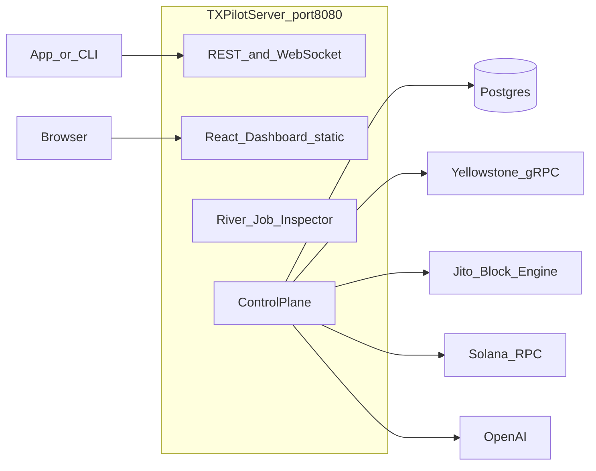
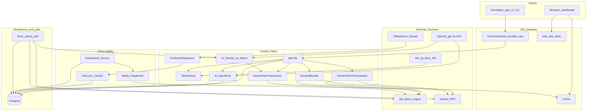
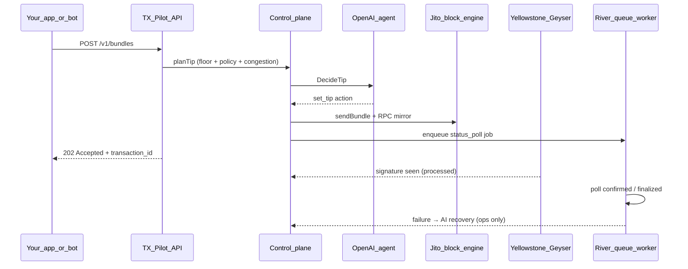
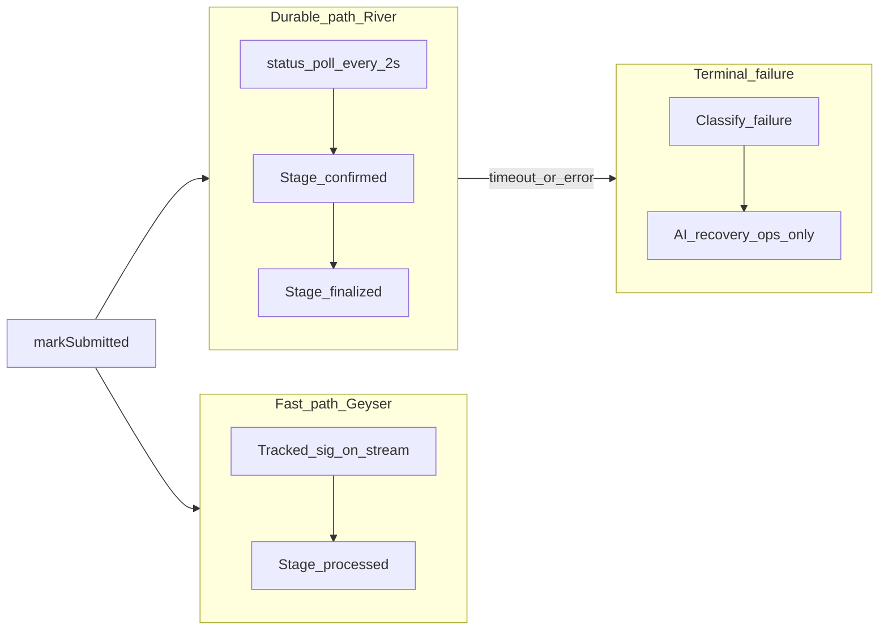
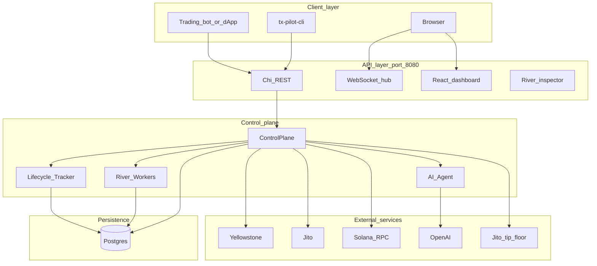
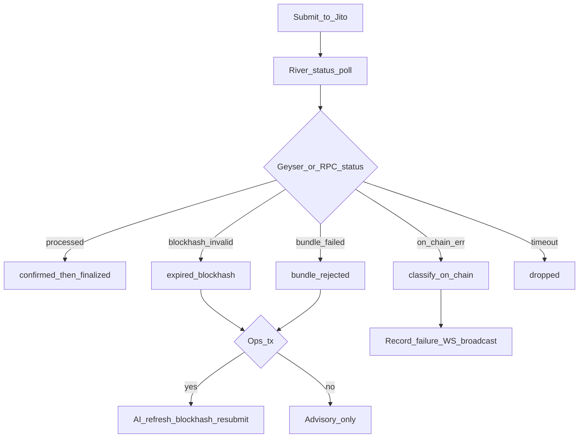
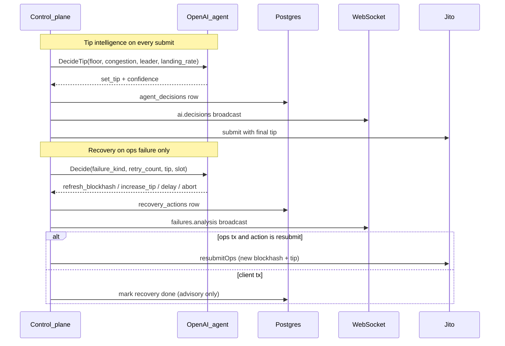
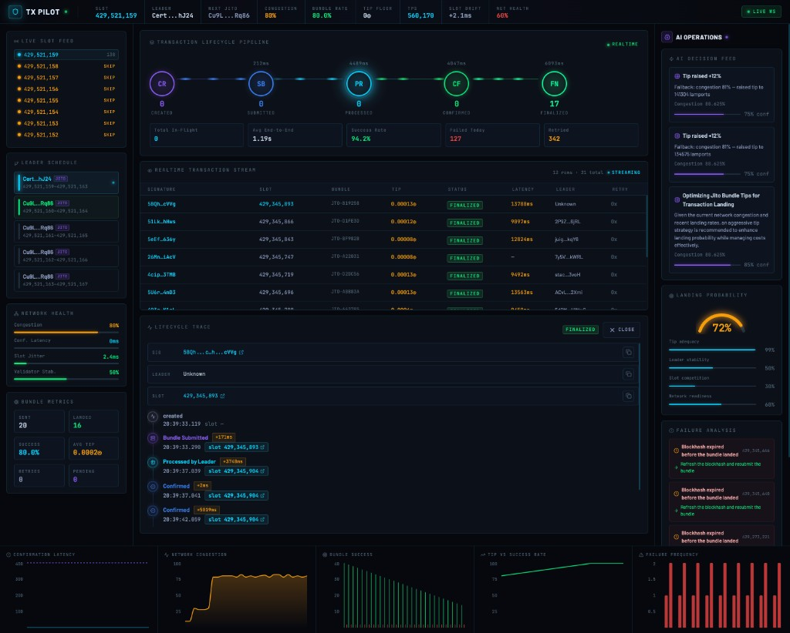
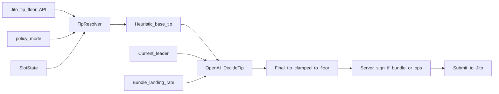

# TX Pilot Architecture Design Document

TX Pilot is an autonomous transaction control plane for Solana. It runs beside your application, handles Jito bundle submission, tracks each transaction through commitment stages, classifies failures, and uses an AI agent to adjust tips and recover from common errors on server-originated transactions.

This document describes the system architecture, key components, data flow, infrastructure choices, failure handling, and AI agent responsibilities. It is written for bounty reviewers and operators who need to understand how the stack works without reading every source file.

**Working prototype on mainnet-beta.** Plug in RPC, Yellowstone, and OpenAI credentials, fund an ops keypair, and run.

---

## Table of contents

1. [Why Solana submission is different](#why-solana-submission-is-different)
2. [System architecture](#system-architecture)
3. [Key components](#key-components)
4. [Data flow between services](#data-flow-between-services)
5. [Infrastructure decisions](#infrastructure-decisions)
6. [Failure handling strategy](#failure-handling-strategy)
7. [AI agent responsibilities](#ai-agent-responsibilities)
8. [Operations dashboard](#operations-dashboard)
9. [Dynamic tip planning](#dynamic-tip-planning)
10. [Transaction lifecycle](#transaction-lifecycle)
11. [Stream confirmation](#stream-confirmation)
12. [MEV and bundle routing](#mev-and-bundle-routing)
13. [Lifecycle log export](#lifecycle-log-export)
14. [References](#references)

---

## Why Solana submission is different

On Bitcoin and Ethereum, transactions sit in a public mempool. Validators or miners pick from that pool. Ordering is uncertain, and propagation adds latency before anything executes.

```
  Bitcoin / EVM (simplified)

  Wallet ──► Mempool (shared, unordered pool)
                  │
                  ▼
            Validator / miner picks txs
                  │
                  ▼
               Block
```

Solana was built for throughput. Instead of a global mempool gossip model, **Gulf Stream** forwards transactions directly toward the **TPU** (Transaction Processing Unit) of the upcoming **leader** validator. Leaders rotate every 4 **slot (~1.6 s)**. You are racing the clock against slot boundaries and leader schedules, not waiting in a public queue.

```
  Solana (simplified)

  Wallet ──► RPC / TPU path ──► Current leader's TPU
                                      │
                               ~400 ms slot
                                      │
                                      ▼
                               Leader builds block
                                      │
                               Next leader already known
                               (schedule known in advance)
```

That design is why blockhash freshness, leader timing, and tip economics matter more here than on EVM. A transaction can look "sent" while missing the leader window entirely.

TX Pilot exists to make that operational work visible and automatable: live slot and leader data, dynamic Jito tips, lifecycle tracking from submission through finalization, and recovery when things go wrong.

---

## System architecture

TX Pilot ships as a **single Go binary** (`cmd/tx-pilot`). On startup it connects to Postgres, Yellowstone gRPC, Solana RPC, Jito block engine, and OpenAI. It serves:

- REST API (`/v1/*`)
- WebSocket streams (`/v1/ws`)
- React operations dashboard (static files from `web/dist`)
- River job inspector (`/riverui`)

All of this runs on one HTTP listener, default `http://localhost:8080`.


### Deployment topology



### Bootstrap sequence

`cmd/tx-pilot/main.go` wires the stack in this order:

1. Connect Postgres and verify schema migrations
2. Load ops keypair (`TX_PILOT_KEYPAIR_PATH`) for server-signed tips and ops txs
3. Dial Yellowstone gRPC and create `SlotState` + `SignatureTracker`
4. Start River queue workers (status poll, webhook delivery)
5. Construct `ControlPlane` with Jito client, tip resolver, AI agent, lifecycle tracker
6. Mount HTTP router (API + dashboard + River UI)
7. Start three background goroutines:
   - **RPC poll** (every 5s): TPS, current slot, 20-slot leader schedule
   - **Dashboard broadcast** (1s network panels, 5s charts): push snapshots over WebSocket
   - **Geyser subscriber**: slot updates and tracked signature landing

No separate frontend or worker process is required for normal operation.

---

## Key components

The codebase is organized under `internal/` with thin `cmd/` entrypoints.

### Component map

| Role | Package | Responsibility |
|------|---------|----------------|
| **Ingress** | `internal/api` | Chi REST routes, WebSocket hub, static web UI (`registerWebUI`) |
| **Orchestration** | `internal/app` | `ControlPlane`: submit paths, tip planning, stream handler, recovery bridge |
| **Streaming** | `internal/stream` | Yellowstone gRPC subscriber, `SlotState`, `SignatureTracker` |
| **Submission** | `internal/bundle` | Jito JSON-RPC client, `TipResolver` (live floor API) |
| **RPC** | `internal/rpc` | Solana RPC gateway (blockhash, sig status, leaders, TPS) |
| **Lifecycle** | `internal/lifecycle` | Sharded append-only event tracker with inter-stage `latency_ms` |
| **Queue** | `internal/queue` | River workers: per-tx status poll, webhook delivery |
| **Failures** | `internal/failure` | Typed failure taxonomy with titles and recommended actions |
| **AI** | `internal/agent` | OpenAI tip intelligence + failure recovery decisions |
| **Scheduler** | `internal/scheduler` | Ops submission timing (delay on skipped leader slots) |
| **Notify** | `internal/notify` | WebSocket fanout, webhooks, dashboard broadcast |
| **Dashboard** | `internal/dashboard` | Live aggregates from DB + slot state + chart points |
| **Storage** | `internal/storage` | Postgres, sqlc queries, goose migrations |
| **Tx factory** | `internal/tx` | Transaction builder, codec, server signer |
| **Frontend** | `web/` | React + Vite dashboard (TanStack Query, Recharts) |

### Binaries

| Binary | Purpose |
|--------|---------|
| `cmd/tx-pilot` | Main API server |
| `cmd/tx-pilot-cli` | Client CLI: signs txs, POSTs to API |
| `cmd/tx-pilot-lifecycle-runner` | Bounty evidence: ops submits + lifecycle export |
| `cmd/tx-pilot-demo` | Demo scenario dispatcher |

### Component relationships



---

## Data flow between services

Data moves through three parallel paths: background ingestion (always on), submit (on API request), and confirmation (per transaction).

### Background ingestion

These loops run for the lifetime of the server.

```
Yellowstone Geyser ──► SlotState (current slot, congestion, leaders)
RPC poll (5s)      ──► TPS, leader schedule supplement
Dashboard broadcast ──► WebSocket: network, slots, pipeline, charts
```

**SlotState** (`internal/stream/slot_state.go`) holds the current slot, congestion score, leader schedule, and stream lag. Geyser slot updates are the primary source. RPC polling fills gaps when the stream reconnects or slot data is stale.

**Dashboard broadcast** (`cmd/tx-pilot/main.go`, `broadcastDashboard`) snapshots dashboard aggregates every 1 second and chart series every 5 seconds, then pushes them through the notify dispatcher to subscribed WebSocket clients.

### Submit path

When a client calls `POST /v1/transactions`, `/v1/bundles`, or `/v1/ops/submit`:



Steps in detail:

1. API returns **202 Accepted** immediately with `transaction_id`, tip metadata, and bundle/signature identifiers.
2. `planTip` fetches the live Jito tip floor, applies policy mode and congestion multipliers, then asks OpenAI for a final `set_tip` recommendation (never below floor).
3. Control plane inserts a `transactions` row and emits a `created` lifecycle event.
4. Submission goes to Jito (and RPC mirror for client paths). Signatures are registered in `SignatureTracker`.
5. A River `status_poll` job is enqueued for durable confirmation tracking.

### Submission paths

| Endpoint | Tip on-chain | Jito method | RPC mirror |
|----------|--------------|-------------|------------|
| `POST /v1/transactions` | Advisory only (client-signed, unchanged) | `sendTransaction` | Yes |
| `POST /v1/bundles` | Server-signed tip tx appended | `sendBundle` | Yes |
| `POST /v1/ops/submit` | Embedded in self-transfer | `sendTransaction` | No |

**Client-signed payloads are never modified or re-signed.** Pre-signed transactions on `/v1/transactions` are forwarded as-is. The stack cannot append a server tip without breaking the client's signature.

For client submissions (`/v1/transactions` and `/v1/bundles`), TX Pilot submits through Jito **and** mirrors each transaction through the configured Solana RPC. Submission succeeds if either path accepts the payload. This improves landing reliability when the block engine drops multi-tx bundles.

### Confirmation path (dual landing)

Landing is confirmed through two parallel mechanisms. RPC polling alone is not sufficient for bounty requirements; Geyser stream subscription is the fast path.



**Fast path:** Geyser emits base58 signatures matched against `SignatureTracker`. A match calls `ControlPlane.OnStreamSignature`, which records `processed` before RPC polling catches up.

**Durable path:** River `StatusPollWorker` (`internal/queue/river.go`) runs every 2-3 seconds per transaction, up to 5 minutes:

- Single tx: `getSignatureStatuses` + `isBlockhashValid`
- Bundle: signature status first, then `getBundleStatuses` and `getInflightBundleStatuses`
- Progresses `processed` → `confirmed` → `finalized`
- Each stage writes `lifecycle_events`, updates `transactions`, and broadcasts over WebSocket

**Terminal failure:** When poll exhausts retries or detects an unrecoverable state, the worker classifies the failure, writes a `failures` row, and triggers AI recovery for ops transactions only.

### Per-transaction worker model

TX Pilot uses **Go goroutines** for hot paths (Geyser reader, dashboard broadcast, lifecycle fanout) and **River** (Postgres-backed) for durable per-transaction work.

```
  Submit tx_A ──► River job_A ──► worker polls A ──► confirmed / failed
  Submit tx_B ──► River job_B ──► worker polls B ──► confirmed / failed
  Submit tx_C ──► River job_C ──► worker polls C ──► confirmed / failed

  (A, B, C run in parallel; failure on B does not stall A or C)
```

Lifecycle events are written through **8 sharded channels** so concurrent transactions append events in parallel without a single global lock.

---

## Infrastructure decisions

These choices trade off simplicity, operability, and bounty requirements.

| Decision | Choice | Rationale |
|----------|--------|-----------|
| **Language** | Go | Goroutines fit concurrent per-tx poll loops and stream ingestion. Single static binary for production. Faster iteration on CLI and integration tests than Rust for this prototype scale. |
| **Process model** | Single binary | API, dashboard, River workers, and background loops colocated. One process to deploy, one port to expose. |
| **Database** | Postgres + sqlc + goose | Durable lifecycle events, agent decisions, failures, chart points. sqlc generates type-safe queries. goose manages migrations. |
| **Job queue** | River (Postgres-backed) | Per-transaction status poll jobs survive restarts. Workers reschedule independently. Inspect live jobs at `/riverui`. |
| **Stream source** | Yellowstone gRPC | Live slots, leaders, and signature landing. Reconnect with exponential backoff (1s to 30s cap). |
| **Landing confirmation** | Geyser + RPC + Jito bundle status | Bounty requires stream subscriptions. Geyser gives `processed` early; RPC and Jito confirm later stages and bundle state. |
| **Dashboard delivery** | React build in `web/dist`, served by Go API | No separate frontend server. Same-origin cookies and WebSocket. `WebDir` config points to built assets. |
| **AI provider** | OpenAI `gpt-4o-mini` | Structured JSON actions for tip and recovery. Rule-based fallback when API or parse fails (`internal/agent/retry_policy.go`). |
| **Signing** | Server keypair for tips and ops only | `TX_PILOT_KEYPAIR_PATH` signs bundle tip txs and ops self-transfers. Client txs are forwarded unchanged. |
| **Blockhash commitment** | `processed` | `finalized` trails chain tip by ~32 slots (~13s). Time-sensitive submits need the freshest hash. TX Pilot always fetches blockhashes at `processed` commitment. |

### Infrastructure stack layers



### Why Go (not Rust or Node.js)

- **Thousands of concurrent submissions** without thread-per-request cost. Each transaction gets its own poll loop and lifecycle shard.
- **Simple worker pools** for Geyser ingestion, lifecycle tracking, and River job handlers with clear cancellation via `context`.
- **Fast iteration** on operational tooling while compiling to a single static binary.

Rust would give similar concurrency with more upfront complexity for API iteration speed. Node.js async works for I/O but struggles with CPU-bound signature handling and long-lived worker supervision at high fanout.

---

## Failure handling strategy

TX Pilot classifies failures at submit time, during status polling, and from on-chain execution errors. Each classification includes a human-readable title, recommended action, and evidence payload.

### Failure taxonomy

| Kind | Title | When detected | Recommended action |
|------|-------|---------------|-------------------|
| `expired_blockhash` | Blockhash expired | `isBlockhashValid` returns false, or submit error | Refresh blockhash and resubmit |
| `tip_below_floor` | Tip below floor | Submit error mentioning tip or priority fee | Increase tip above dynamic floor |
| `compute_exceeded` | Compute budget exceeded | On-chain or submit error | Raise compute unit limit and retry |
| `bundle_rejected` | Bundle rejected by Jito | Inflight `Failed`/`Invalid` past grace period | Recalculate tip and retry |
| `insufficient_funds` | Insufficient funds | On-chain Custom(1) or rent shortfall | Fund account and resubmit |
| `instruction_error` | Instruction failed on-chain | Other on-chain execution errors | Inspect error and fix inputs |
| `leader_skipped` | Leader skipped slot | Slot gap on stream | Wait for next leader window |
| `stream_gap` | Stream gap detected | Geyser disconnect or lag | Reconnect and verify status |
| `rpc_error` | RPC error | RPC call failure | Retry with fresh evidence |
| `dropped` | Dropped | Poll timeout (5 min / 150 attempts) | Inspect timeline, resubmit if needed |
| `unknown` | Unknown failure | Unmatched error text | Inspect lifecycle timeline |

Source: `internal/failure/classify.go`, `pkg/txpilot/types.go`.

### Failure detection and response flow



### Handling layers

| Layer | Mechanism | Location |
|-------|-----------|----------|
| **Submit-time** | `failure.Classify()` → DB failure row, `StageFailed`, no poll job | `control_plane.go` |
| **Jito HTTP** | Rate-limit retry (4x exponential backoff on 429 / congested) | `bundle/client.go` |
| **Status poll** | Reschedule every 2s (pending) / 3s (finalize); max 5 min | `queue/river.go` |
| **Blockhash expiry** | `isBlockhashValid` → `expired_blockhash` | `queue/river.go` |
| **Bundle rejection** | Inflight `Failed` or `Invalid` past 15s grace → `bundle_rejected` | `queue/river.go` |
| **On-chain errors** | `ClassifyOnChain()` with raw error preserved in evidence | `queue/river.go` |
| **AI recovery (ops only)** | Poll failure → `RecoveryBridge.Trigger` → OpenAI `Decide` → `resubmitOps` | `recovery.go` |
| **Client txs** | AI records advisory decision; recovery marked done without resubmit | `recovery.go` |
| **OpenAI fallback** | Rule-based decisions if API or parse fails | `agent/retry_policy.go` |
| **Geyser disconnect** | Auto-reconnect; `SlotState.IncReconnect()` | `stream/geyser.go` |

### Recovery actions (AI or fallback)

| Action | What it does |
|--------|--------------|
| `refresh_blockhash` | Fetch new `processed` blockhash, rebuild ops tx, resubmit |
| `increase_tip` | Recalculate tip above floor, resubmit |
| `delay_submission` | Wait one slot (scheduler), then resubmit |
| `change_mode` | Switch policy mode (e.g. SAFE → FAST), replan tip |
| `abort` | Mark recovery done, no further retries |

### Evidence from mainnet runs

Lifecycle evidence from `TestBountyLifecycleLog` on mainnet-beta:

- **10 submissions** (8 success, 2 failure)
- **2 failures**: injected expired blockhash via `POST /v1/ops/submit` with `inject_expired_blockhash: true`
- Both failures classified as `expired_blockhash` and triggered autonomous AI recovery (refresh blockhash, recalc tip, resubmit)

Full records: [lifecycle-log-evidence.md](lifecycle-log-evidence.md).

---

## AI agent responsibilities

TX Pilot uses OpenAI (`gpt-4o-mini` by default) for two distinct operational paths. Both persist decisions to `agent_decisions` and broadcast on the `ai.decisions` WebSocket channel.

### Path 1: Tip intelligence (every submission)

**When:** Every `POST /v1/transactions`, `/v1/bundles`, and `/v1/ops/submit`.

**Input facts:**

- Jito tip floor (live API percentiles)
- Policy mode (`SAFE`, `FAST`, `CHEAP`, `AGGRESSIVE`)
- Congestion score from `SlotState`
- Current leader and leader quality
- Recent bundle landing rate

**Output:** Structured `tip_intelligence` decision with `set_tip` action and confidence score.

**Execution:** Final tip is the agent's recommendation, clamped to never fall below the live floor. Persisted after the transaction row exists via `commitTipDecision`.

**Code:** `internal/app/tip_builder.go` (`planTip`), `internal/agent/decider.go` (`DecideTip`).

### Path 2: Failure recovery (ops transactions only)

**When:** River status poll worker detects a terminal failure on an ops transaction (memo prefix `tx-pilot-ops:`).

**Input facts:**

- Failure kind and title
- Retry attempt count
- Current tip and floor
- Current slot, leader, congestion

**Output:** Structured recovery action.

**Execution:** `HandleFailureRecovery` → `resubmitOps` builds a new server-signed tx with fresh blockhash and replanned tip. Parent `retry_attempt` increments. A new transaction row is created for the retry.

**Code:** `internal/app/recovery.go`, `internal/agent/decider.go` (`Decide`).

### Recovery boundary

| Transaction type | AI on failure | Server resubmit |
|------------------|---------------|-----------------|
| Ops (`/v1/ops/submit`) | Yes | Yes, autonomous |
| Client (`/v1/transactions`, `/v1/bundles`) | Yes, advisory | No. Client must rebuild and resubmit signed payload |

For client transactions, the agent still reasons and records decisions, but recovery actions are marked `done` without server resubmit. The server cannot modify client-signed bytes.

Fault injection (`inject_expired_blockhash: true` on `/v1/ops/submit`) demonstrates the full detect → reason → refresh blockhash → recalc tip → resubmit loop without hardcoded retry logic.

### AI agent sequence



### Fallback when OpenAI is unavailable

`internal/agent/retry_policy.go` provides rule-based decisions:

- Tip: use heuristic base from `TipResolver` without AI adjustment
- Recovery: map failure kind to default action (e.g. `expired_blockhash` → `refresh_blockhash`)

The stack keeps operating; AI decisions are degraded but not blocked.

---

## Operations dashboard

The dashboard is the primary observability surface for operators. It runs on the **same TX Pilot server** as the API. There is no separate frontend process.

### Where it lives

| Environment | URL |
|-------------|-----|
| Local dev | `http://localhost:8080` |
| Production | `TX_PILOT_HTTP_ADDR` (default `:8080`) |

The Go API serves the built React app from `web/dist` via `registerWebUI` in `internal/api/http.go`. In development you can run `pnpm dev` on `:5173` with Vite proxying API calls, but production ships a single binary serving both API and UI.

Additional operator tools on the same server:

- **River job inspector:** `http://localhost:8080/riverui`
- **REST API:** `http://localhost:8080/v1/*`
- **WebSocket:** `http://localhost:8080/v1/ws`

### Dashboard screenshot



**What the screenshot shows:**

| Panel | Data source |
|-------|-------------|
| **Top ticker** | Current slot, TPS, congestion %, net health, leader identity, next Jito leader, bundle rate, slot drift |
| **Lifecycle pipeline** | Stage counts: Created → Submitted → Processed → Confirmed → Finalized. Avg end-to-end time and success rate |
| **Live slot feed** | Recent slots with leader pubkey and Jito-enabled flag |
| **Network health** | Congestion, confirmation latency, validator stability |
| **Bundle metrics** | Landed vs submitted bundle count |
| **Transaction stream** | Per-tx signature, slot, bundle ID, tip (SOL), status, latency |
| **Lifecycle trace** | Drill-down audit trail for selected tx (timestamps, slots, leader at each stage) |
| **AI decision feed** | Tip adjustments with reasoning (e.g. "Tip raised +12% due to 81% congestion") |
| **Landing probability** | Gauge with factor breakdown (tip adequacy, leader stability, slot competition, network readiness) |
| **Failure analysis** | Classified failures with recommended recovery strategy |
| **Bottom charts** | Confirmation latency, network congestion, bundle success, tip vs success rate, failure frequency |

### How data arrives

1. **Initial load:** REST snapshot endpoints (`/v1/dashboard/snapshot`, `/network`, `/slots`, etc.)
2. **Live updates:** WebSocket subscription on `/v1/ws` with typed channels
3. **Broadcast loop:** `broadcastDashboard` in `cmd/tx-pilot/main.go` pushes network, slots, leaders, pipeline, landing, recovery every 1s; charts every 5s

The frontend (`web/src/hooks/useDashboardData.ts`) merges WebSocket messages into view state and falls back to polling when disconnected.

### WebSocket channels

| Channel | Content |
|---------|---------|
| `network.ticker` | Slot, TPS, congestion, health |
| `slots.feed` | Recent slot events |
| `leaders.schedule` | Leader windows and Jito flags |
| `lifecycle.pipeline` | Stage aggregates |
| `transactions.stream` | Per-tx lifecycle updates |
| `ai.decisions` | Agent tip and recovery decisions |
| `landing.probability` | Landing score and factors |
| `failures.analysis` | Failure classifications |
| `recovery.actions` | Recovery execution status |
| `charts.series` | Rolling chart data |

Full contract: [dashboard-data.md](dashboard-data.md).

---

## Dynamic tip planning

Tip calculation never uses hardcoded values. Every submission goes through a three-step pipeline.

### Step 1: Heuristic base tip (`TipResolver.Recommend`)

1. Fetch live Jito tip floor percentiles from `JITO_TIP_FLOOR_URL`
2. Select percentile from `policy_mode`:
   - `CHEAP` → 25th
   - `SAFE` → 50th
   - `FAST` → 75th
   - `AGGRESSIVE` → 95th
3. Scale by congestion (`SlotState.CongestionScore`, up to +25%) and leader quality
4. Clamp to dynamic floor (25th percentile, minimum `JITO_MIN_TIP_LAMPORTS`)
5. Honor explicit `tip_lamports` override from caller (clamped to floor if below)

### Step 2: AI tip intelligence (`agent.DecideTip`)

OpenAI receives live facts and returns a structured `set_tip` action. Final tip is the agent recommendation, still never below the live floor.

### Step 3: Signing and attach

| Path | Where tip is applied |
|------|---------------------|
| `/v1/bundles` | Separate server-signed tip transfer appended as last bundle tx |
| `/v1/ops/submit` | Tip embedded in ops self-transfer |
| `/v1/transactions` | Not attached on-chain. Advisory only in API response and DB |



---

## Transaction lifecycle

### Stages

```
created → submitted → processed → confirmed → finalized
                              ↘ failed
```

| Stage | Meaning |
|-------|---------|
| `created` | Transaction row inserted, tip planned |
| `submitted` | Accepted by Jito (and optionally RPC mirror) |
| `processed` | Leader included tx; cluster has seen it (Geyser fast path) |
| `confirmed` | Supermajority voted on fork |
| `finalized` | Maximum commitment level |
| `failed` | Terminal error with classified failure kind |

### What gets captured

Each stage transition writes to `lifecycle_events` with:

- Timestamp
- Slot number
- Leader at that slot
- `latency_ms` delta from previous stage

The `transactions` table holds current status, tip, bundle ID, and failure kind for fast queries.

### Tracker design

`internal/lifecycle/tracker.go` uses **8 sharded async workers**. Critical stages (`created`, `submitted`, `failed`, `processed`, `confirmed`, `finalized`) are written synchronously to guarantee ordering for terminal states.

### Export endpoints

| Endpoint | Returns |
|----------|---------|
| `GET /v1/lifecycle-log` | Bounty-format export with slot numbers, commitment progression, timestamps, tips, failures |
| `GET /v1/transactions/{id}/timeline` | Per-tx stage events with `latency_ms` |

---

## Stream confirmation

### Yellowstone integration

- **Client:** TLS gRPC to `YELLOWSTONE_GRPC_URL` with optional `x-token` auth
- **Subscriptions:** All slot updates; up to 64 tracked signatures with dynamic filter refresh (150ms debounce)
- **Reconnect:** Exponential backoff from 1s to 30s cap
- **Landing:** Matched signature → `OnStreamSignature` → `processed` stage

### SignatureTracker

At submit time, all transaction signatures are registered in `SignatureTracker`. The Geyser subscriber filters transaction updates to tracked signatures only. When a match arrives, the control plane records `processed` immediately.

RPC polling then progresses `confirmed` and `finalized`. This dual path satisfies the bounty requirement that landing confirmation uses stream subscriptions, not RPC alone.

### Blockhash freshness

Blockhashes for server signing use **`processed` commitment** (`fetchProcessedBlockhash`). `finalized` trails chain tip by ~32 slots (~13 seconds). A blockhash valid at `finalized` may already be expired at the current tip where your transaction would land.

---

## MEV and bundle routing

A classic sandwich attack front-runs and back-runs your swap around public mempool visibility. Routing through **Jito bundles** with a private submission path gives **atomic ordering**: your txs execute together or not at all, without unrelated txs inserted between them.

TX Pilot appends a dynamically priced tip so bundles stay competitive without hardcoded values.

| Protection | How TX Pilot helps |
|------------|-------------------|
| Atomic bundle ordering | Client txs + tip tx submitted as one Jito bundle |
| Private submission path | Jito block engine, not public mempool broadcast |
| Dynamic tip | Live floor + congestion + AI adjustment |
| Dual landing | Jito + RPC mirror for client paths when block engine drops bundles |

This is not a guarantee against all MEV, but it is strictly better than firing transactions into a public RPC and hoping.

### Leader skip behavior

If the assigned leader **skips** their slot (no block produced), your bundle does not execute in that window. It may land on a later attempt if the blockhash is still valid, or expire and fail.

TX Pilot watches slot gaps on the Geyser feed, records leader context on every lifecycle event, and may delay one slot in `SAFE`/`CHEAP` modes when the schedule looks unfavorable.

---

## Lifecycle log export

Bounty requirement: at least 10 real bundle submissions including 2 failure cases.

Collect evidence:

```bash
go run ./cmd/tx-pilot-lifecycle-runner -count 10 -failures 2
```

Or run the integration test:

```bash
go test ./test/... -run TestBountyLifecycleLog -v
```

Export via API:

```bash
curl http://localhost:8080/v1/lifecycle-log
```

Each entry includes slot numbers, commitment progression, timestamps, tip amounts, latency deltas, leader, and failure classification.

Verified mainnet evidence with full signatures and explorer links:

- [lifecycle-log-evidence.md](lifecycle-log-evidence.md)
- [lifecycle-log-evidence2.md](lifecycle-log-evidence2.md)

---

## References

### Repository documentation

| Document | Contents |
|----------|----------|
| [setup.md](setup.md) | Install, `.env` variables, Docker Postgres, migrations, first run |
| [architecture.md](architecture.md) | Shorter internal architecture reference |
| [operations.md](operations.md) | Submit flows, curl examples, CLI helper |
| [dashboard-data.md](dashboard-data.md) | REST and WebSocket contract for the ops dashboard |
| [lifecycle-log.md](lifecycle-log.md) | Lifecycle export format and evidence collection |

### Stack

Go · Chi · Postgres · sqlc · goose · River · Yellowstone gRPC · Jito block engine · OpenAI `gpt-4o-mini` · React · Vite

### API summary

| Endpoint | Description |
|----------|-------------|
| `POST /v1/transactions` | Forward pre-signed tx; advisory tip in response |
| `POST /v1/bundles` | Client txs + server-signed dynamic tip |
| `POST /v1/ops/submit` | Server-signed ops tx with embedded tip |
| `GET /v1/lifecycle-log` | Bounty lifecycle export |
| `GET /v1/transactions/{id}` | Poll status |
| `GET /v1/transactions/{id}/timeline` | Stage events + `latency_ms` |
| `GET /v1/dashboard/*` | Live ops dashboard data |
| `GET /v1/ws` | WebSocket streams |

### Architecture diagram source

[tx-pilot-architecture.svg](../tx-pilot-architecture.svg)
