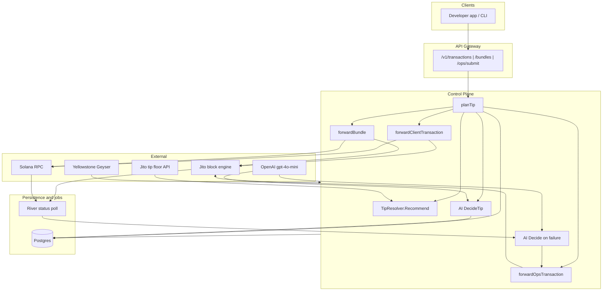

# TX Pilot Architecture

TX Pilot is an autonomous Solana transaction control plane. It observes Yellowstone/Geyser streams, plans dynamic Jito tips from live floor data and network state, signs tip transactions where the protocol allows, tracks lifecycle via Geyser stream confirmation + Solana RPC + Jito bundle status polling, classifies failures, and uses an OpenAI agent (`gpt-4o-mini`) for tip intelligence and autonomous recovery on server-originated operational transactions.

## Components

- **API Gateway** (`internal/api`): Chi REST + WebSocket; tx/bundle/ops submit, lifecycle export, tracking, dashboard, River UI mount.
- **Control Plane** (`internal/app`): Submission orchestration, dynamic tip planning, AI decision persistence, stream landing handler, recovery bridge.
- **Stream Engine** (`internal/stream`): Yellowstone gRPC slots/transactions with reconnect; `SignatureTracker` for landing confirmation.
- **Bundle Router** (`internal/bundle`): Jito client + `TipResolver` (live Jito tip floor API, policy-mode percentiles, congestion/leader multipliers).
- **RPC Gateway** (`internal/rpc`): Solana RPC (`getLatestBlockhash` at `processed`, `getSignatureStatuses`, `isBlockhashValid`, leaders, TPS).
- **Lifecycle Tracker** (`internal/lifecycle`): Sharded workers, append-only events with inter-stage `latency_ms`.
- **Failure Classifier** (`internal/failure`): Typed failure taxonomy with human-readable titles and evidence.
- **AI Agent** (`internal/agent`): OpenAI tip intelligence on every submit + failure recovery decisions; persisted to `agent_decisions`.
- **Scheduler** (`internal/scheduler`): Submission timing (delay on skipped leader slots for ops).
- **River Queue** (`internal/queue`): Status poll jobs + recovery trigger on terminal failures.
- **Notify** (`internal/notify`): WebSocket fanout (`transactions.stream`, `failures.analysis`, `ai.decisions`).
- **Dashboard** (`internal/dashboard`): Live aggregates from DB + slot state + chart points.
- **Storage** (`internal/storage`): Postgres + sqlc + goose migrations.

## Data flow



## Submission paths

Each submit handler in `internal/api/http.go` delegates to the control plane and returns `202 Accepted` with `transaction_id`, tip metadata, and bundle/signature identifiers.

| Path | Behavior |
|------|----------|
| `POST /v1/transactions` | Accepts a **pre-signed client transaction unchanged**. Plans a dynamic tip (for telemetry and AI audit), then submits via Jito `sendTransaction` + RPC mirror. The client payload is **not** re-signed or modified — a server tip cannot be appended without invalidating the signature. Response includes the **advisory** `tip_lamports` the stack would recommend for a bundle submission. |
| `POST /v1/bundles` | Accepts 1–4 pre-signed client transactions. Plans a dynamic tip, fetches a `processed` blockhash, **signs and appends a separate server tip tx**, then submits via Jito `sendBundle` + RPC mirror of every tx in the bundle. |
| `POST /v1/ops/submit` | Server-signed self-transfer with **embedded Jito tip** in a single transaction (`BuildSelfTransferWithTip`). Submitted via Jito `sendTransaction`. Supports `inject_expired_blockhash` for fault-injection demos. |

Optional `tip_lamports` on all submit endpoints overrides the computed tip (still clamped to the live floor). Optional `policy_mode` (`SAFE`, `FAST`, `CHEAP`, `AGGRESSIVE`) selects which Jito floor percentile drives the base tip.

### Dual landing strategy

For client submissions (`/v1/transactions` and `/v1/bundles`), TX Pilot submits through Jito **and** mirrors each transaction through the configured Solana RPC. Submission succeeds if either path accepts the payload. This improves landing reliability when the public block engine drops multi-tx bundles.

Ops submissions use Jito `sendTransaction` only (tip is embedded in the single signed tx).

## Dynamic tip planning

Tip calculation lives in `internal/app/tip_builder.go` (`planTip`) and `internal/bundle/tip.go` (`TipResolver`).

### Step 1 — Heuristic base tip (`TipResolver.Recommend`)

1. Fetch live Jito tip floor percentiles from `JITO_TIP_FLOOR_URL`.
2. Select a percentile from `policy_mode`:
   - `CHEAP` → 25th
   - `SAFE` → 50th
   - `FAST` → 75th
   - `AGGRESSIVE` → 95th
3. Scale by **congestion** (`SlotState.CongestionScore`, up to +25%) and **leader quality** (small premium when leader is unknown).
4. Clamp to the dynamic floor (25th percentile, minimum `JITO_MIN_TIP_LAMPORTS`).
5. Honor an explicit `tip_lamports` override from the caller (`tip_source: caller`, or `floor_clamped` if below floor).

### Step 2 — AI tip intelligence (`agent.DecideTip`)

After the heuristic base is computed, OpenAI receives live facts:

- congestion %, floor lamports, base tip, current leader, leader quality, recent bundle landing rate

The agent returns a structured `set_tip` action. The final tip is the agent's recommendation, still **never below the live floor**.

Every tip decision is persisted to `agent_decisions` via `commitTipDecision` (after the transaction row exists) and broadcast on the `ai.decisions` WebSocket channel.

### Step 3 — Signing and attach

| Path | Where tip is applied |
|------|---------------------|
| `/v1/bundles` | Separate server-signed tip transfer appended as the last bundle tx (`buildSignedTipTx`) |
| `/v1/ops/submit` | Tip embedded in the ops self-transfer (`BuildSelfTransferWithTip`) |
| `/v1/transactions` | **Not attached on-chain** — advisory only in the API response and DB |

## Server signing model

`TX_PILOT_KEYPAIR_PATH` loads the ops keypair used by `tx.Factory` to sign:

1. **Bundle tip transactions** — a standalone transfer to a randomly selected Jito tip account, appended to client bundles (`POST /v1/bundles`).
2. **Ops transactions** — a single server-signed tx carrying the payload and embedded tip (`POST /v1/ops/submit`).
3. **Autonomous recovery resubmits** — new ops txs after AI-driven failure recovery (refresh blockhash, recalc tip, resubmit).

**Client-signed payloads are never modified or re-signed.** Pre-signed transactions submitted via `POST /v1/transactions` are forwarded as-is; the stack cannot append a server tip without breaking the client's signature.

Blockhashes for all server signing use **`processed` commitment** (`fetchProcessedBlockhash`) to maximize the valid window relative to chain tip.

## AI agent responsibilities

TX Pilot implements two bounty-aligned agent paths (see `.cursor/skills/bounty.md`):

### 1. Tip intelligence (every submission)

- **When:** `planTip` on every `POST /v1/transactions`, `/v1/bundles`, and `/v1/ops/submit`.
- **Input:** Jito floor, policy mode, congestion, leader, landing rate.
- **Output:** Structured `tip_intelligence` decision with `set_tip` action and confidence.
- **Persistence:** `agent_decisions` row linked to the transaction; dashboard AI feed.

### 2. Failure reasoning + autonomous retry (ops only)

- **When:** River status poll worker detects a terminal failure on an ops transaction (`tx-pilot-ops:` memo prefix).
- **Input:** Failure kind/title, retry attempt, current tip, floor, slot, leader, congestion.
- **Output:** Structured recovery action — `refresh_blockhash`, `increase_tip`, `delay_submission`, `change_mode`, or `abort`.
- **Execution:** `HandleFailureRecovery` → `resubmitOps` builds a new server-signed tx with fresh blockhash and replanned tip; parent `retry_attempt` increments.

For **client** transactions, the agent still reasons and records advisory decisions on failure, but the client must rebuild and resubmit their signed payload. Recovery actions are marked `done` without server resubmit.

Fault injection (`inject_expired_blockhash: true` on `/v1/ops/submit`) demonstrates the full detect → reason → refresh blockhash → recalc tip → resubmit loop without hardcoded retry logic.

## Autonomous recovery boundary

When an **ops** transaction fails (e.g. expired blockhash):

1. Status poll worker records failure + human-readable reason in `failures`
2. OpenAI agent analyzes failure and persists decision to `agent_decisions`
3. Recovery orchestrator executes the agent's action (refresh blockhash, recalc tip, optional delay, resubmit)
4. A new transaction row is created for the retry attempt; `retry_attempt` increments on the parent

For **client** transactions, the agent records advisory decisions only — no automatic resubmit.

## Stream confirmation

Geyser emits base58 signatures matched against a `SignatureTracker` registry populated at submit time. Stream matches record `processed` immediately; RPC/Jito polling progresses `confirmed` → `finalized`.

## Failure handling

- Submit errors → classified + `failed` status + `failures` row
- Blockhash expiry → detected via `isBlockhashValid`; ops txs trigger autonomous AI recovery
- Bundle rejected → tip intelligence adjusts on retry
- On-chain execution errors → `ClassifyOnChain` with raw error preserved in evidence

## Lifecycle log export

`GET /v1/lifecycle-log` returns structured entries with slot numbers, commitment progression, timestamps, tip amounts, latency, leader, and failure classification.

Run the bounty evidence collector:

```bash
go run ./cmd/tx-pilot-lifecycle-runner -count 10 -failures 2
```
