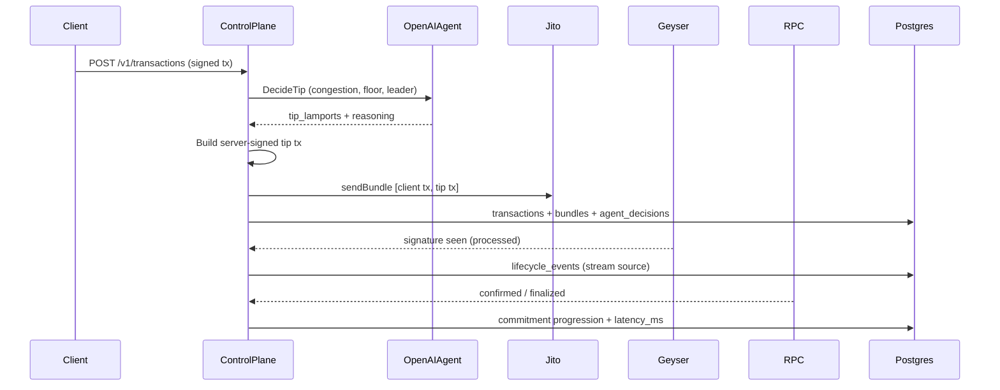

# Aegis Architecture

Aegis is an autonomous Solana transaction control plane. It observes Yellowstone/Geyser streams, applies dynamic Jito tips via server-signed tip transactions, tracks lifecycle via Geyser stream confirmation + Solana RPC + Jito bundle status polling, classifies failures, and uses an OpenAI agent (`gpt-4o-mini`) for tip intelligence and autonomous recovery on server-originated operational transactions.

## Components

- **API Gateway** (`internal/api`): Chi REST + WebSocket; tx/bundle/ops submit, lifecycle export, tracking, dashboard, River UI mount.
- **Control Plane** (`internal/app`): Submission orchestration, tip planning, AI decision persistence, stream landing handler, recovery bridge.
- **Stream Engine** (`internal/stream`): Yellowstone gRPC slots/transactions with reconnect; `SignatureTracker` for landing confirmation.
- **Bundle Router** (`internal/bundle`): Jito client + `TipResolver` (live Jito tip floor API + congestion multiplier).
- **RPC Gateway** (`internal/rpc`): Solana RPC (`getLatestBlockhash` at `processed`, `getSignatureStatuses`, `isBlockhashValid`, leaders, TPS).
- **Lifecycle Tracker** (`internal/lifecycle`): Sharded workers, append-only events with inter-stage `latency_ms`.
- **Failure Classifier** (`internal/failure`): Typed failure taxonomy with human-readable titles and evidence.
- **AI Agent** (`internal/agent`): OpenAI tip intelligence + failure recovery decisions; persisted to `agent_decisions`.
- **Scheduler** (`internal/scheduler`): Submission timing (delay on skipped leader slots).
- **River Queue** (`internal/queue`): Status poll jobs + recovery trigger on terminal failures.
- **Notify** (`internal/notify`): WebSocket fanout (`transactions.stream`, `failures.analysis`, `ai.decisions`).
- **Dashboard** (`internal/dashboard`): Live aggregates from DB + slot state + chart points.
- **Storage** (`internal/storage`): Postgres + sqlc + goose migrations.

## Data Flow



## Submission paths

| Path | Behavior |
|------|----------|
| `POST /v1/transactions` | Auto-wraps client tx + server tip tx into Jito bundle |
| `POST /v1/bundles` | Appends dynamic server tip tx (max 4 client txs + tip) |
| `POST /v1/ops/submit` | Server-signed self-transfer + tip; supports `inject_expired_blockhash` fault injection |

Optional `tip_lamports` on all submit endpoints lets developers override the AI/heuristic tip.

## Server signing model

`AEGIS_KEYPAIR_PATH` loads an ops keypair used to sign **tip transactions** and **operational demo/resubmit transactions** only. Client-signed payloads are never modified or re-signed.

## Autonomous recovery boundary

When an **ops** transaction fails (e.g. expired blockhash):

1. Status poll worker records failure + human-readable reason in `failures`
2. OpenAI agent analyzes failure and persists decision to `agent_decisions`
3. Recovery orchestrator executes the agent's action (refresh blockhash, recalc tip, resubmit)
4. A new transaction row is created for the retry attempt; `retry_attempt` increments on the parent

For **client** transactions, the agent still reasons and records advisory decisions, but the client must rebuild/resubmit their signed payload. The server can refresh its tip tx on the next bundle attempt.

## Stream confirmation

Geyser emits base58 signatures matched against a `SignatureTracker` registry populated at submit time. Stream matches record `processed` immediately; RPC/Jito polling progresses `confirmed` → `finalized`.

## Failure handling

- Submit errors → classified + `failed` status + `failures` row
- Blockhash expiry → detected via `isBlockhashValid`; ops txs trigger autonomous AI recovery
- Bundle rejected → tip intelligence adjusts on retry
- On-chain execution errors → `ClassifyOnChain` with raw error preserved in evidence

## Lifecycle log export

`GET /v1/lifecycle-log` returns structured entries with slot numbers, commitment progression, timestamps, tip amounts, latency, leader, and failure classification.

Run the bounty evidence collector:

```bash
go run ./cmd/aegis-lifecycle-runner -count 10 -failures 2
```
